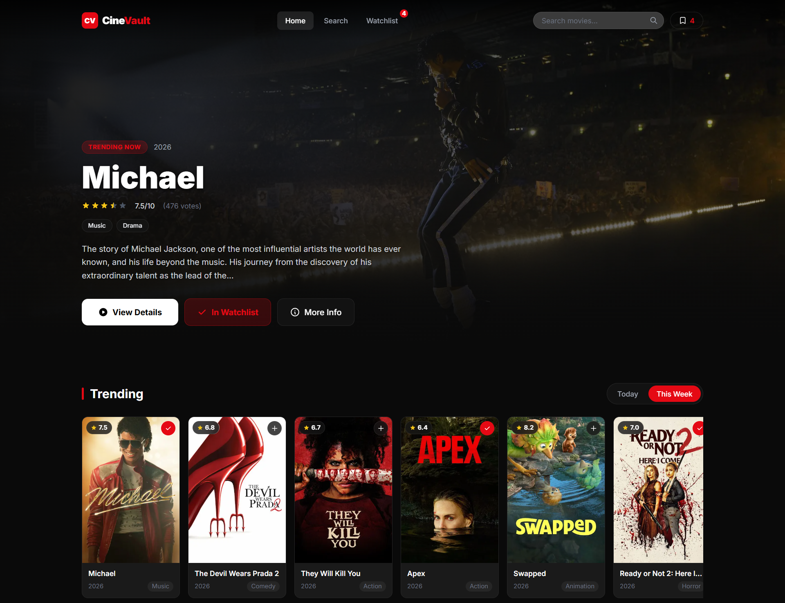
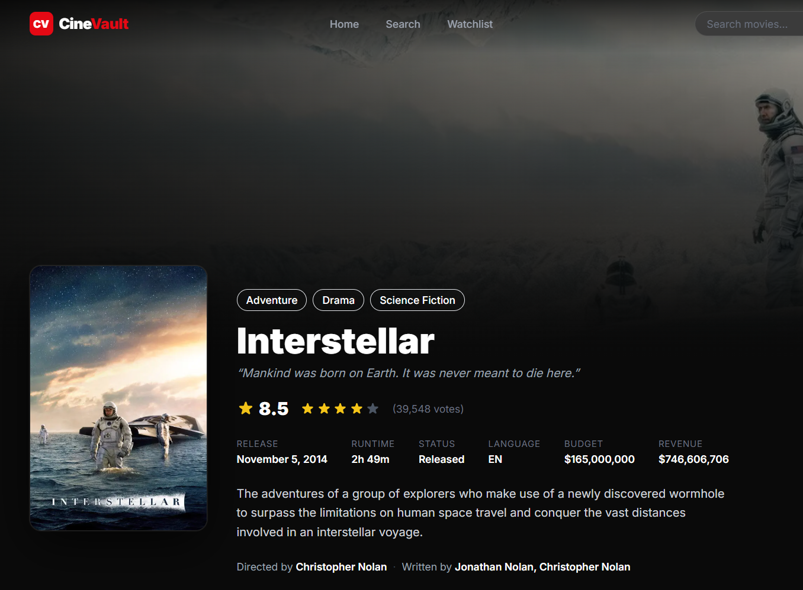
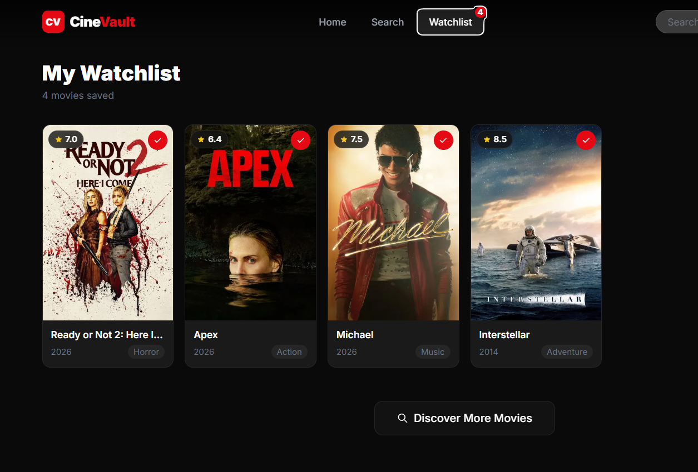
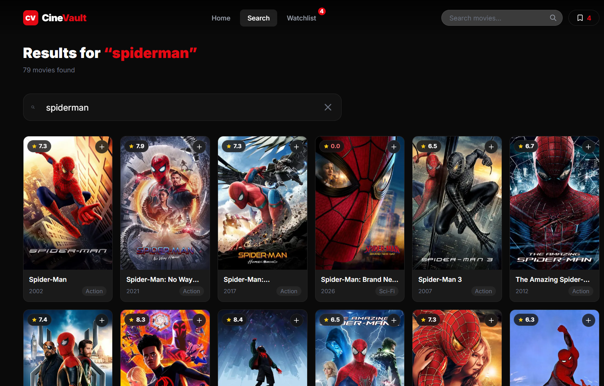
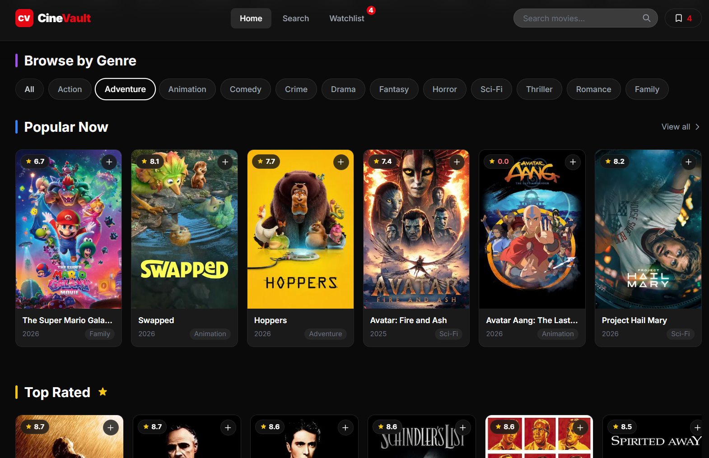
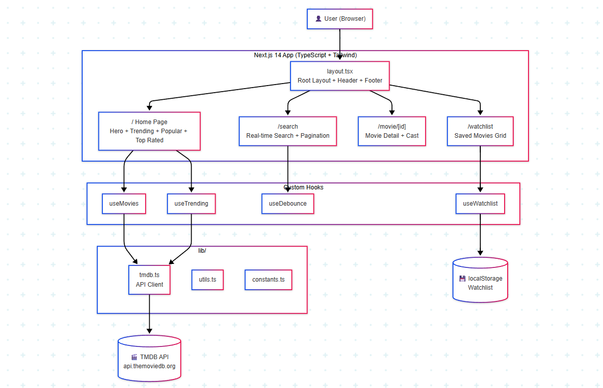

# 🎬 CineVault — Discover Your Next Favorite Film



> CineVault is a modern cinematic movie discovery platform where you can explore trending, popular, and top-rated films, search across thousands of titles, browse by genre, and build your personal watchlist — all powered by the TMDB API and built with Next.js 14, TypeScript, and Tailwind CSS. No sign-up required, no database, just pure cinema.

[](https://nextjs.org/)
[](https://www.typescriptlang.org/)
[](https://tailwindcss.com/)
[](https://www.themoviedb.org/)
[](LICENSE)

---

## ✨ Features

- 🎥 **Hero Section** — Featured trending movie with backdrop, rating, genres, and action buttons
- 🔥 **Trending Movies** — Toggle between daily and weekly trending, horizontal scroll row
- 🌟 **Popular & Top Rated** — Curated movie grids and rows with live TMDB data
- 🎭 **Genre Filter** — Color-coded genre badges to filter the popular movies grid
- 🔍 **Real-time Search** — Debounced search with instant results and pagination
- 🎬 **Movie Detail Page** — Full info: backdrop, poster, cast, trailer link, runtime, budget, revenue
- 📌 **Watchlist** — Add/remove movies, persisted in `localStorage`, grid + list views
- 💀 **Loading Skeletons** — Shimmer placeholders for all async content
- ⚠️ **Error States** — Graceful error UI with retry for all fetch failures
- 📱 **Fully Responsive** — Mobile, tablet, and desktop layouts
- 🌑 **Dark Cinematic Theme** — Glassmorphism cards, gradient overlays, smooth animations

---

## 📸 Screenshots

<table>
  <tr>
    <td width="50%"><p align="center">🎬 Movie Detail</p></td>
    <td width="50%"><p align="center">📌 Watchlist</p></td>
  </tr>
  <tr>
    <td width="50%"><p align="center">🔍 Search</p></td>
    <td width="50%"><p align="center">🎭 Browse by Genre</p></td>
  </tr>
</table>

---

## 🏗 Architecture



---

## 🚀 Getting Started

### 1. Get a TMDB API Key

1. Go to [https://www.themoviedb.org](https://www.themoviedb.org) and create a free account
2. Navigate to **Settings → API**
3. Request an API key — choose **Developer** for personal projects
4. Copy your **API Key (v3 auth)**

### 2. Clone the Repository

```bash
git clone https://github.com/mdryaan/cinevault.git
cd cinevault
```

### 3. Install Dependencies

```bash
npm install
```

### 4. Configure Environment Variables

```bash
cp .env.example .env.local
```

Edit `.env.local` and add your key:

```env
NEXT_PUBLIC_TMDB_API_KEY=your_tmdb_api_key_here
```

### 5. Run the Development Server

```bash
npm run dev
```

Open [http://localhost:3000](http://localhost:3000) in your browser.

---

## 🔑 Environment Variables

| Variable | Description | Required |
|----------|-------------|----------|
| `NEXT_PUBLIC_TMDB_API_KEY` | Your TMDB v3 API key | ✅ Yes |

---

## 🛠 Tech Stack

| Technology | Purpose |
|-----------|---------|
| Next.js 14 (App Router) | Framework, SSR, routing |
| TypeScript (strict) | Type safety |
| Tailwind CSS | Styling, animations |
| TMDB API | Movie data source |
| localStorage | Watchlist persistence |

---

## 🤝 Contributing

Contributions are welcome! Please read [CONTRIBUTING.md](CONTRIBUTING.md) before submitting a pull request. Whether it's a bug fix, new feature, or UI improvement — all contributions are appreciated.
