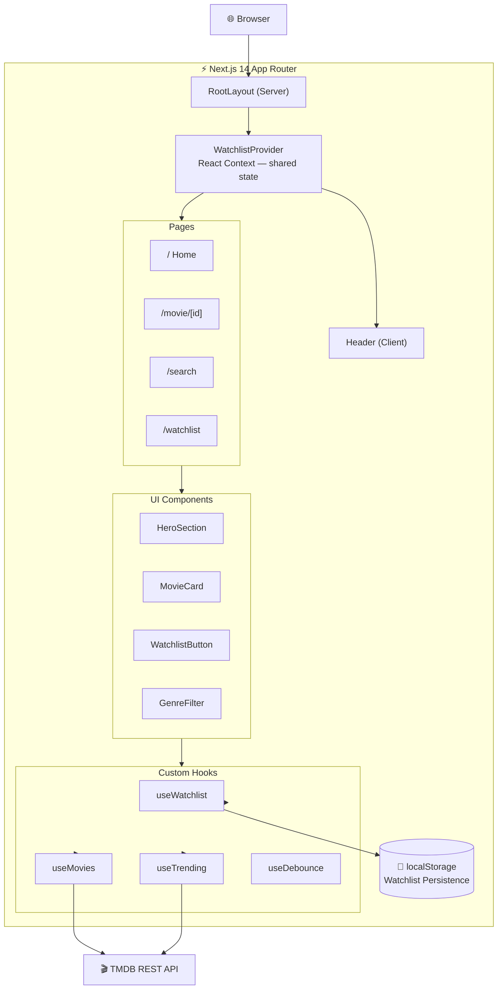

# 🎬 CineVault — Discover Your Next Favorite Film

CineVault is a full-featured cinematic movie discovery platform where you can explore what's trending daily or weekly, search thousands of titles with instant results, browse by genre, dive into rich movie detail pages with cast and trailers, and curate a personal watchlist that persists across sessions — all powered by live TMDB data and wrapped in a sleek dark glassmorphism UI built with Next.js 14, TypeScript, and Tailwind CSS.

[](https://nextjs.org/)
[](https://www.typescriptlang.org/)
[](https://tailwindcss.com/)
[](https://www.themoviedb.org/)
[](LICENSE)

[](https://your-demo-url.vercel.app)

---


---

## ✨ Features

- 🎥 **Hero Section** — Featured trending movie with backdrop, rating, genres, and action buttons
- 🔥 **Trending Movies** — Toggle between daily and weekly trending, horizontal scroll row
- 🌟 **Popular & Top Rated** — Curated movie grids and rows with live TMDB data
- 🎭 **Genre Filter** — Color-coded genre badges to filter the popular movies grid
- 🔍 **Real-time Search** — Debounced search with instant results and pagination
- 🎬 **Movie Detail Page** — Full info: backdrop, poster, cast, trailer link, runtime, budget, revenue
- 📌 **Watchlist** — Add/remove movies, persisted in `localStorage`, grid + list views
- 💀 **Loading Skeletons** — Shimmer placeholders for all async content
- ⚠️ **Error States** — Graceful error UI with retry for all fetch failures
- 📱 **Fully Responsive** — Mobile, tablet, and desktop layouts
- 🌑 **Dark Cinematic Theme** — Glassmorphism cards, gradient overlays, smooth animations

---

## 📸 Screenshots

| | |
|:---:|:---:|
|  |  |
|  |  |

---

## 🏗 Architecture

> Copy the Mermaid code below and paste it at [https://mermaid.live](https://mermaid.live) to generate the diagram, then add the image yourself.



---

## 🚀 Getting Started

### 1. Get a TMDB API Key

1. Go to [https://www.themoviedb.org](https://www.themoviedb.org) and create a free account
2. Navigate to **Settings → API**
3. Request an API key (choose "Developer" for personal projects)
4. Copy your **API Key (v3 auth)**

### 2. Clone the Repository

```bash
git clone https://github.com/mdryaan/CinaVault.git
cd CinaVault
```

### 3. Install Dependencies

```bash
npm install
```

### 4. Configure Environment Variables

```bash
cp .env.example .env.local
```

Edit `.env.local` and add your TMDB API key:

```env
NEXT_PUBLIC_TMDB_API_KEY=your_tmdb_api_key_here
```

### 5. Run the Development Server

```bash
npm run dev
```

Open [http://localhost:3000](http://localhost:3000) in your browser.

---

## 🔑 Environment Variables

| Variable | Description | Required |
|----------|-------------|----------|
| `NEXT_PUBLIC_TMDB_API_KEY` | Your TMDB v3 API key | ✅ Yes |

---

## 🛠 Tech Stack

| Technology | Purpose |
|-----------|---------|
| Next.js 14 (App Router) | Framework, SSR, routing |
| TypeScript (strict) | Type safety |
| Tailwind CSS | Styling, animations |
| TMDB API | Movie data source |
| React Context | Shared watchlist state |
| localStorage | Watchlist persistence |

---

## 🤝 Contributing

Contributions are welcome! Please read [CONTRIBUTING.md](CONTRIBUTING.md) for the full workflow.

---

## 📄 License

MIT © Md Raiyan — see [LICENSE](LICENSE) for details.
